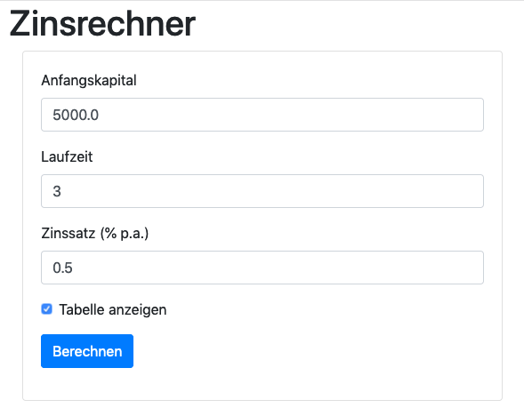
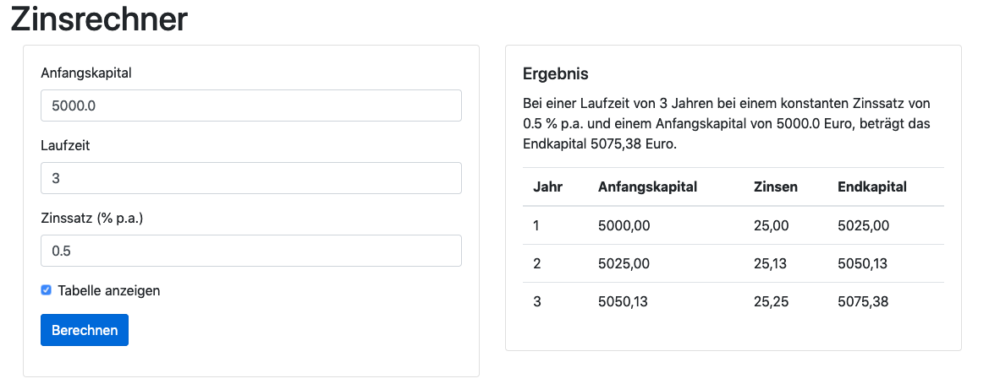
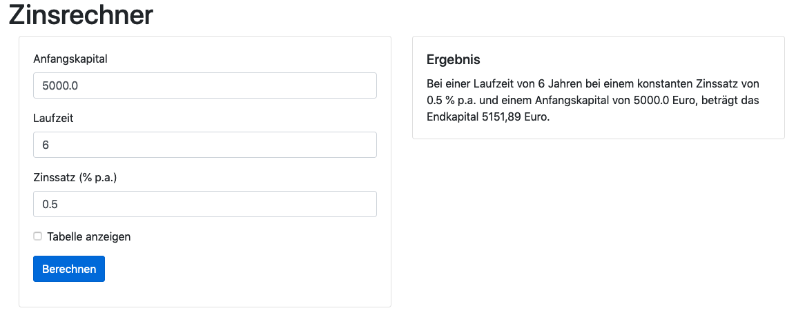

= Softwareentwicklung im Team: Praktische Übung 6
:icons: font
:icon-set: fa
:experimental:
:source-highlighter: rouge
ifdef::env-github[]
:tip-caption: :bulb:
:note-caption: :information_source:
:important-caption: :heavy_exclamation_mark:
:caution-caption: :fire:
:warning-caption: :warning:
:stem: latexmath
endif::[]

== Vorbereitung 

Die Vorbereitungsarbeiten müssen Sie *vor der praktischen Übung* abschließen. 
 
Wir erwarten von Ihnen, dass Sie verstanden haben, wie Spring Web MVC und Thymeleaf funktioniert. 

== Ziele der Übung

In der Übung sollen Sie eine kleine Webanwendung mit Spring Web MVC implementieren. Sie sollen den Umgang mit Templates und Controllern einüben.

== Aufgabe

Wir wollen eine Webanwendung implementieren, die den Zinsertrag für einen angelegten Betrag berechnen kann. Dazu soll ein Formular, das in etwa wie folgt aussieht angezeigt werden.

Wenn das Formular abgeschickt wurde, dann soll das Ergebnis berechnet werden und in etwa wie folgt angezeigt werden (jeweils mit und ohne Tabelle)

Die Daten aus der Eingabe sollen immer im Ergebnis auch mit angezeigt werden. 

Es gibt keine Projektvorgabe, starten Sie mit dem https://start.spring.io[Spring Initializr]. Sie benötigen mindestens Spring Web und Thymeleaf, die Verwendung der DevTools wird sehr empfohlen.

Die Datei `zinsform` html enthält den HTML Code der Webseite. Dort müssen aber noch die Thymeleaf Attribute eingetragen werden. Ein Teil der HTML Elemente muss auch ausgeblendet werden, z.B. die Tabelle rechts, wenn die Checkbox "Tabelle anzeigen" nicht ausgewählt wurde.

Die Bootstrap Bibliothek wird von einer externen Quelle bezogen. Sie können die Bibliothek auch lokal herunterladen, es ist dann aber ggf. notwendig in dem `<link>` Tag sowohl das `href` als auch das `th:href` Attribut zu verwenden. Der Trick wird im https://youtu.be/GVq0uzpHYoQ?t=644[Video] von Wochenblatt 6 am Beispiel eines Bildes erklärt.

== Ablauf der Übung

. Schalten Sie *mindestens* das Mikrofon, aber besser auch die Kamera, ein 
. Am Anfang gibt es eine kurze Vorstellungsrunde 
. Es wird festgelegt, in welcher Reihenfolge die "Driver" Rolle übernommen wird
. Die erste Person teilt Ihren Screen und übernimmt mithilfe von `mob` die Session
. Es wird an der Problemstellung gemeinsam gearbeitet nach den Regeln des Mob Programmings 
. Nach ca. der Hälfte der Zeit gibt es ein Feedback durch die Tutorin oder den Tutor
. Es wird weiter an der Problemstellung gearbeitet
. ca. 10 Minuten vor Ende der Session bekommen Sie Ihre Abschlussbewertung 

NOTE: Diese praktische Übung wird für die Zulassung gewertet. Sie müssen vorbereitet sein und einen hinreichenden Beitrag leisten. 

== Verhaltensregeln

Wir erwarten von Ihnen einen respektvollen Umgang miteinander. Es gilt grundsätzlich bei uns der https://berlincodeofconduct.org/de/[Berlin Code of Conduct]. Die TutorInnen haben die Aufgabe, die Einhaltung der Regeln zu überwachen und können bei Verstößen gegen den Verhaltenskodex Personen aus der praktischen Übung entfernen.   

